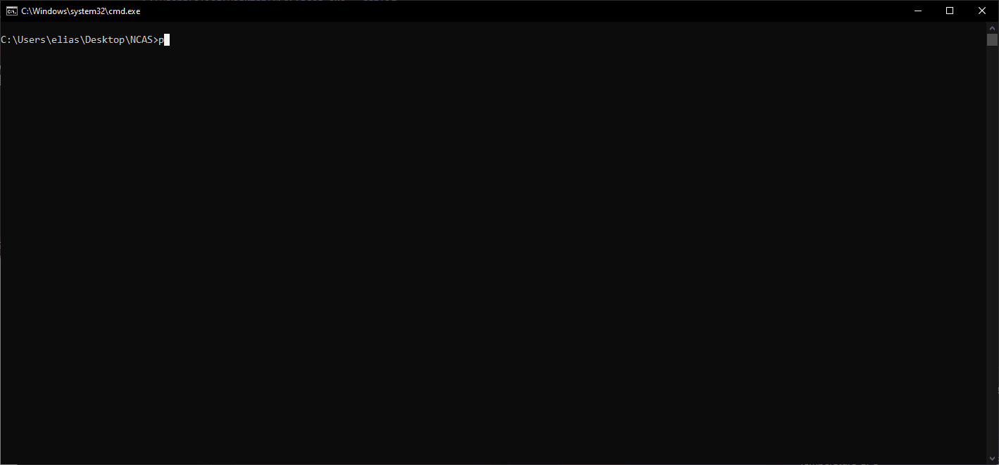

# NCAS

NCAS est un script Python3 qui affiche les mots de passe WiFi enregistrés dans Windows. NCAS est basé sur netsh.

#### Translation

Version [anglaise](../README.md) du README.

## Features

- Afficher les mots de passe de chaque accès points de  dont l'ordinateur a été connecté.
- Peut exporter un ou plusieurs profil Wi-Fi:
  - Vers .xml (le format est utilisé pour l'importation)
  - Vers .txt
  - Vers .xlms (format Excel)
- Peut importer un ou plusieurs profil Wi-Fi.
- Dispose d'une interface interactive.
- Peut supprimer des profil Wi-Fi.
- Peut énumérer les SSIDS.
- Peut afficher les interfaces réseau sans fil.



## Installation

NCAS a une version portable, vous pouvez simplement la télécharger et lancer NCAS.exe.
Si le programme ferme une premiére fois, réouvrez le un  seconde fois.

### Installation de la version Python

```python
  cd ncas-master
  pip install -r requirements
  python ncas.py --config
  python ncas.py
```

#### Dépendances

Si vous souhaitez installer les dépendances manuellement:
- terminaltables
- pandas
- colorama

## Testé sur
<table>
    <tr>
        <th> Système d'exploitation </th>
    </tr>
    <tr>
        <td>Windows 10</td>
    </tr>
    <tr>
        <td>Windows 11</td>
    </tr>
</tr>
</table>

#### Crédits
La version exécutable a été faite avec [auto-py-to-exe](https://github.com/brentvollebregt/auto-py-to-exe)